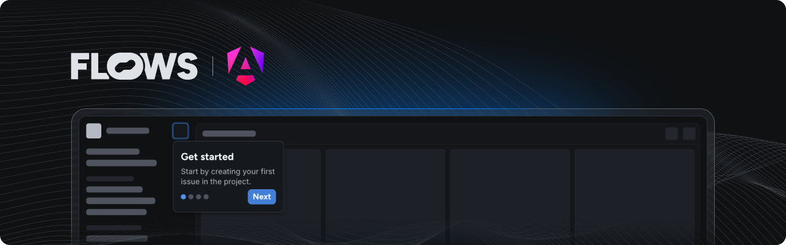

# Flows Angular example

An example project showcasing how to use Flows with Angular to build native product growth experiences.

This example extends the Angular starter project with the [`@flows/js`](https://www.npmjs.com/package/@flows/js) package and shows custom Modal component.

## Features

### Flows service

In [`flows.service.ts`](./src/app/flows/flows.service.ts) you can find Flows service that is imported to [`app.component.ts`](./src/app/app.component.ts) and initialized in the browser during the `ngOnInit()` lifecycle method.

### Floating blocks

In [`flows-blocks.component.ts`](./src/app/flows/flows-blocks/flows-blocks.component.ts) you can see a component that takes care of rendering of floating blocks. The component needs to be added at the end of the body element in our case in [`app.component.html`](./src/app/app.component.html).

### Flows slot

The `<flows-slot>` component lets you render Flows UI elements dynamically within your application. You can add placeholder UI for empty states. Refer to [`flows-slot.component.ts`](./src/app/flows/flows-slot/flows-slot.component.ts) for implementation and to [`app.component.html`](./src/app/app.component.html) for example usage.

### Custom components

Modal [`component`](./src/app/flows/components/modal/flows-components-modal.component.ts) and [`tour component`](./src/app/flows/tour-components/modal/flows-tour-components-modal.component.ts) demonstrates how to implement default block template.

In [`styles.css`](./src/styles.css) you can find all the styles copy-pasted from `@flows/js-components` stylesheet needed for the Modal and Tooltip component.

## Documentation

Learn more about Flows and how to use its features in the [official Flows documentation](https://flows.sh/docs).
