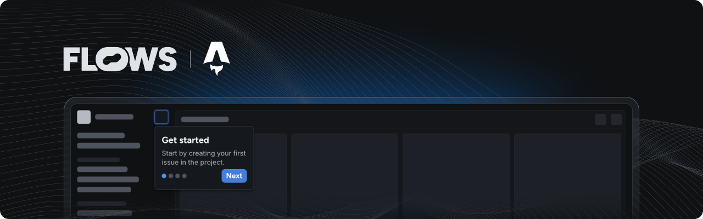

# Flows Astro example

An example project showcasing how to use Flows with Astro to build native product growth experiences.

<!-- TODO: add -->
<!--  -->

This example extends the Astro starter project with the [`@flows/js`](https://www.npmjs.com/package/@flows/js) and [`@flows/js-components`](https://www.npmjs.com/package/@flows/js-components) packages to demonstrate how to integrate Flows into your application.

## Features

### Flows component

In [`flows.astro`](./src/components/flows.astro) you can find Flows being initialized in `<script>` in the browser. In its render we've added `<flows-floating-blocks>` custom element to render floating components. The Flows component is rendered in the root layout found in [`Layout.astro`](./src/layouts/Layout.astro).

### Pre-built components

The `@flows/js-components` package includes ready-to-use components to build in-app experiences. Refer to [`flows.astro`](./src/components/flows.astro) to learn how to import and use these components.

### Custom components

Extends Flows by creating your own components. Because the components need to be valid Web Components you cannot use Astro components for this. If you're using client side framework in you Astro project like React, Solid, Svelte or Vue, you can follow one of [other example projects](../README.md). Or just create your own custom element with Vanilla JavaScript or lightweight [Lit library](../lit/README.md).

### Flows slots

The `<flows-slot>` element lets you render Flows UI elements dynamically within your application. You can add placeholder UI for empty states. See [`index.astro`](./src/pages/index.astro) for an example.

## Documentation

Learn more about Flows and how to use its features in the [official Flows documentation](https://flows.sh/docs).
