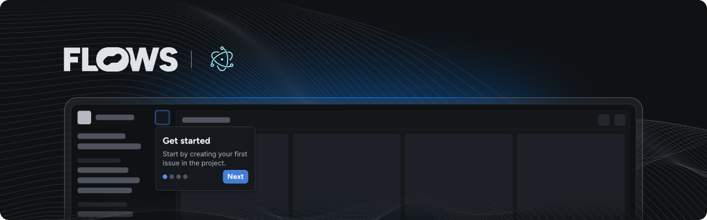

# Flows Electron Forge with React example

An example project showcasing how to use Flows with Electron Forge with React to build native product growth experiences.

<!-- TODO: -->
<!--  -->

This example extends the Electron Forge Webpack + TypeScript starter project with React install with the [`@flows/react`](https://www.npmjs.com/package/@flows/react) and [`@flows/react-components`](https://www.npmjs.com/package/@flows/react-components) packages to demonstrate how to integrate Flows into your application.

## Features

### Flows component

In [`flows.tsx`](./src/app/flows.tsx) you can example implementation of the FlowsProvider. In [`layout.tsx`](./src/app/layout.tsx) the Flows component is Rendered.

### Pre-built components

The `@flows/react-components` package includes ready-to-use components to build in-app experiences. Refer to [`flows.tsx`](./src/app/flows.tsx) to learn how to import and use these components.

### Custom components

Extend Flows by creating your own components for workflows and tours. Refer to [Next.js example](../../react/next/README.md) for more info.

Note that to use these custom components you need to define them in your Flows organization with the same properties and exit nodes. For detailed instructions on building custom components, see the [custom components documentation](https://flows.sh/docs/components/custom).

### Flows slots

The `<flows-slot>` element lets you render Flows UI elements dynamically within your application. You can add placeholder UI for empty states. See [`page.tsx`](./src/app/page.tsx) for an example.

## Documentation

Learn more about Flows and how to use its features in the [official Flows documentation](https://flows.sh/docs).
