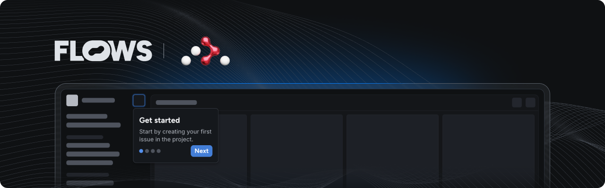

# Flows React Router Vite example

An example project showcasing how to use Flows with React Router and Vite to build native product growth experiences.

This example extends the React Router Framework template with the [`@flows/react`](https://www.npmjs.com/package/@flows/react) and [`@flows/react-components`](https://www.npmjs.com/package/@flows/react-components) packages to demonstrate how to integrate Flows into your application.

## Features

### Flows provider

The `<FlowsProvider>` component sets up the Flows context for your application. See [`flows.tsx`](./app/flows.tsx) for an example implementation.

### Pre-built components

The `@flows/react-components` package includes ready-to-use components to build in-app experiences. Refer to [`flows.tsx`](./app/flows.tsx) to learn how to import and use these components.

### Custom components

Extend Flows by creating your own components for workflows and tours:

- **Workflow block:** The [`banner.tsx`](./app/components/banner.tsx) file demonstrates a custom `Banner` component with `title`, `body`, and a `close` prop connected to an exit node.
- **Tour block:** The [`tour-banner.tsx`](./app/components/tour-banner.tsx) file shows how to build a `TourBanner` component. It accepts `title` and `body` props, as well as `continue`, `previous` and `cancel` for navigation between tour steps.

For detailed instructions on building custom components, see the [custom components documentation](https://flows.sh/docs/components/custom).

### Flows slots

The `<FlowsSlot>` component lets you render Flows UI elements dynamically within your application. You can add placeholder UI for empty states. See [`welcome.tsx`](./app/welcome/welcome.tsx) for an example.

## Documentation

Learn more about Flows and how to use its features in the [official Flows documentation](https://flows.sh/docs).
