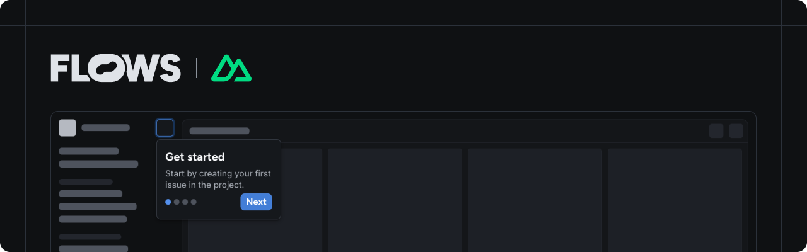

# Flows Vue Nuxt example

An example project showcasing how to use Flows with Nuxt to build native product growth experiences.

This example extends the Nuxt starter project with the [`@flows/js`](https://www.npmjs.com/package/@flows/js) package and shows custom Modal component that is using [`primevue`](https://primevue.org) Dialog under the hood.

## Features

### Flows plugin

In [`plugins/flows.ts`](./plugins/flows.ts) you can find Flows plugin that is calling on `app:mounted` in the browser.

### Floating blocks

In [`blocks.vue`](./components/flows/blocks.vue) you can see a component that takes care of rendering of floating blocks. The component needs to be added before the end of the body element in our case in [`app.vue`](./app.vue).

### Flows slot

The `<FlowsSlot>` component lets you render Flows UI elements dynamically within your application. You can add placeholder UI for empty states. Refer to [`slot.vue`](./components/flows/slot.vue) for implementation and to [`app.vue`](./app.vue) for example usage.

### Custom components

Modal [`component`](./components/flows/components/modal.vue) and [`tour component`](./components/flows/tour/modal.vue) demonstrates how to implement default block template.

For detailed instructions on building custom components, see the [custom components documentation](https://flows.sh/docs/blocks/create-custom-components).

## Documentation

Learn more about Flows and how to use its features in the [official Flows documentation](https://flows.sh/docs).
