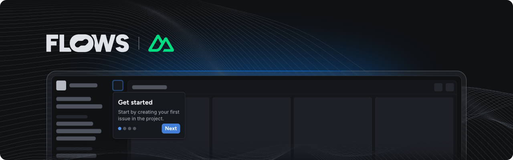

# Flows Vue Nuxt example

An example project showcasing how to use Flows with Nuxt to build native product growth experiences.

This example extends the Nuxt starter project with the [`@flows/js`](https://www.npmjs.com/package/@flows/js) and [`@flows/js-components](https://www.npmjs.com/package/@flows/js-components) packages to demonstrate how to integrate Flows into your application.

## Features

### Flows plugin

In [`plugins/flows.ts`](./app/plugins/flows.ts) you can find Flows plugin being initialized during `app:mounted` hook in the browser. Because `@flows/js-components` is using HTML custom elements for rendering, we need to add `isCustomElement` in [`nuxt.config.ts`](./nuxt.config.ts).

### Pre-built components

The @flows/js-components package includes ready-to-use components to build in-app experiences. Refer to [`plugins/flows.ts`](./app/plugins/flows.ts) to learn how to import and use these components.

### Custom components

Extend Flows by creating your own components for workflows and tours:

- **Workflow block:** The [`banner.vue`](./app/components/banner.vue) file demonstrates a custom `Banner` component with `title`, `body`, and a `close` prop connected to an exit node.
- **Tour block:** The [`tour-banner.vue`](./app/components/tour-banner.vue) file shows how to build a `TourBanner` component. It accepts `title` and `body` props, as well as `continue`, `previous` and `cancel` for navigation between tour steps.

For detailed instructions on building custom components, see the [custom components documentation](https://flows.sh/docs/components/custom).

### Flows slots

The `<flows-slot>` element lets you render Flows UI elements dynamically within your application. You can add placeholder UI for empty states. You can add placeholder UI for empty states. See [app.vue](./app/app.vue) for an example.

## Documentation

Learn more about Flows and how to use its features in the [official Flows documentation](https://flows.sh/docs).
